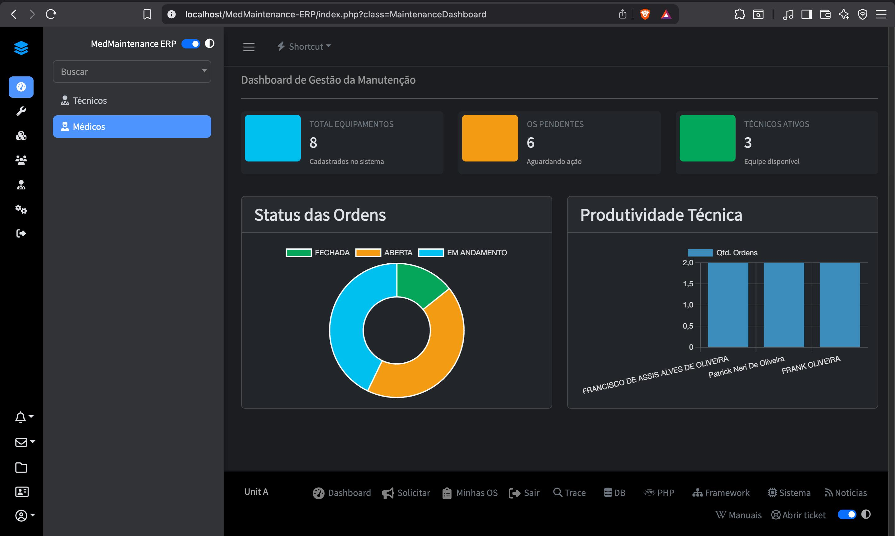
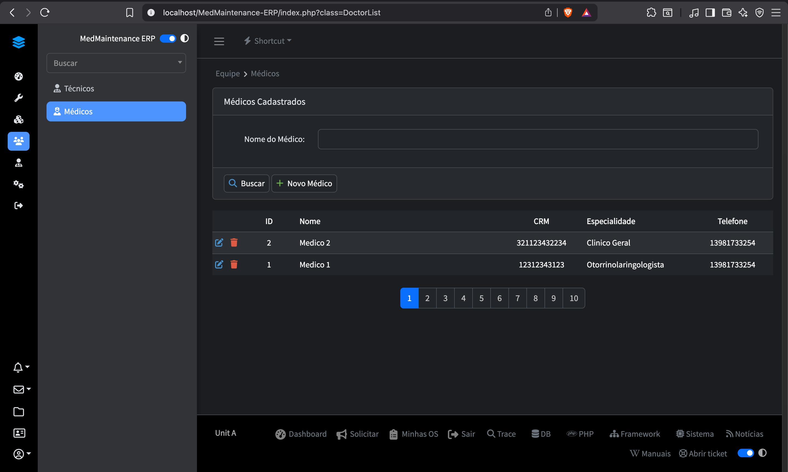

# 🏥 MedMaintenance ERP | Gestão de Engenharia Clínica


> **Enterprise Resource Planning (ERP)** especializado na gestão do ciclo de vida de ativos hospitalares, orquestrando fluxos de manutenção corretiva e preventiva com rastreabilidade total e conformidade técnica.

---

## 📊 Visão Geral do Sistema

| **Dashboard Analytics** | **Gestão de Corpo Clínico** |
|:---:|:---:|
|  |  |
| *KPIs em tempo real para tomada de decisão* | *Controle de equipe e especialidades* |

---

## 🚀 Escopo e Solução

O **MedMaintenance ERP** foi arquitetado para eliminar gargalos na comunicação entre o corpo clínico e a engenharia hospitalar. O sistema substitui planilhas e formulários manuais por um fluxo digital auditável, garantindo maior disponibilidade dos equipamentos médicos vitais.

### 💎 Diferenciais Técnicos

* **🔐 Segurança RBAC (Role-Based Access Control):** Sistema de permissões granulares onde a interface se adapta dinamicamente ao perfil do usuário (Admin, Médico ou Técnico), garantindo que dados sensíveis sejam acessados apenas por pessoal autorizado.
* **✍️ Assinatura Digital & Compliance:** Implementação de coleta de assinatura manuscrita digitalizada (`SignaturePad`), garantindo a validação técnica das ordens de serviço e eliminando o uso de papel.
* **📈 Business Intelligence:** Dashboard integrado com Google Charts para monitoramento de SLA, backlog de manutenção e produtividade da equipe técnica.

---

## 🛠️ Stack Tecnológico

A arquitetura foi desenhada focando em **escalabilidade**, **segurança** e **manutenibilidade**.

| Camada | Tecnologias |
| :--- | :--- |
| **Backend** | PHP 8.x, Adianti Framework (MVC Pattern) |
| **Database** | PostgreSQL (Relacional, ACID Compliance) |
| **Frontend** | HTML5, CSS3, Bootstrap 5, AdminLTE Template |
| **Libs** | `FPDF` (Relatórios), `SignaturePad` (JS), `PHPMailer` |

---

## 🏗️ Arquitetura de Software

O projeto segue estritamente o padrão **MVC (Model-View-Controller)**, promovendo a separação de responsabilidades.

1.  **Camada de Persistência (Model):** Utiliza **Active Record** para abstração do banco de dados, com encapsulamento de transações (`TTransaction`) para garantir integridade referencial em operações complexas.
2.  **Camada de Controle (Controller):** Gerencia as regras de negócio, validações de formulário e controle de fluxo de aprovação das Ordens de Serviço.
3.  **Gestão de Arquivos:** Sistema robusto de upload que move arquivos de áreas temporárias (`tmp`) para armazenamento definitivo (`files/`), com renomeação segura para evitar conflitos.
4.  **Contexto Dinâmico:** Implementação avançada no `index.php` para injeção de dependência de menus XML baseados na sessão do usuário, permitindo múltiplas interfaces em uma única aplicação monólita.

---

## 💻 Instalação e Execução Local

Para rodar o projeto em ambiente de desenvolvimento:

### Pré-requisitos
* PHP 8.1+ com extensões (`pgsql`, `gd`, `mbstring`, `curl`)
* PostgreSQL 14+
* Servidor Web (Apache/Nginx) ou PHP Built-in Server

### Passo a Passo

1.  **Clone o repositório:**
    ```bash
    git clone [https://github.com/SEU_USUARIO/MedMaintenance-ERP.git](https://github.com/SEU_USUARIO/MedMaintenance-ERP.git)
    cd MedMaintenance-ERP
    ```

2.  **Configuração do Banco de Dados:**
    * Crie o banco: `CREATE DATABASE med_maintenance;`
    * Importe a estrutura: `psql -U postgres -d med_maintenance -f database/schema.sql`

3.  **Configuração de Ambiente:**
    * Copie o arquivo de configuração:
      `cp app/config/application.ini.example app/config/application.ini`
    * Edite o arquivo `.ini` com as credenciais do seu ambiente local.

4.  **Permissões (Linux/Mac):**
    ```bash
    chmod -R 777 tmp/ files/ app/config/
    ```

5.  **Acesse:**
    O sistema estará disponível em `http://localhost/MedMaintenance-ERP`

---

## 👤 Autor

<div align="left">
 Desenvolvedor Frank Oliveira. Desenvolvedor Full-stack focado em resolver problemas complexos de negócio através da tecnologia. <br><br>

  <a href="https://www.linkedin.com/in/frank-oliveira-2a7134254/">
    
  </a>
  <a href="mailto:frankoliveiradev@gmail.com">
    
  </a>
</div>
